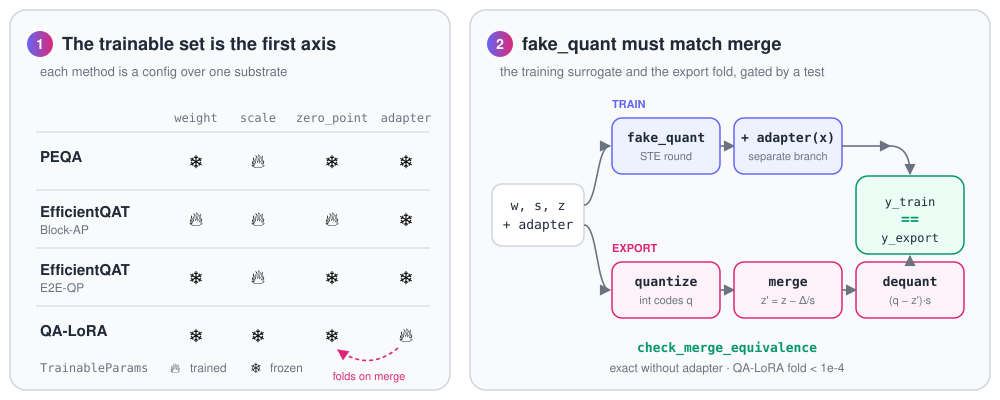

<h1 align="center">
  <picture>
    <source media="(prefers-color-scheme: dark)" srcset="docs/assets/qpeft-logo-dark.svg">
    
  </picture>
</h1>

<h3 align="center">Quantization-aware, PEFT-style tuning whose merge stays quantized.</h3>

<p align="center">
  
  
  
  
  
  
</p>

<p align="center">
  <a href="#basic-usage">Quickstart</a> ·
  <a href="docs/DESIGN.md">Design</a> ·
  <a href="#structure-mirrors-peft">Structure</a> ·
  <a href="#status">Status</a>
</p>

`qpeft` trains over a quantized substrate.
Unlike `peft`, its `merge_and_unload()` does not dequantize back to fp16: it returns the integer codes plus a per-group scale and zero-point, and an adapter folds into those, never into a float weight.
It leans on torchao for low-level primitives (affine quant, packed dtypes, kernels) and owns the one seam neither `peft` nor `unsloth` owns: **a QAT-trained adapter/parameter set that folds into the quantized weights and stays quantized, with a correctness guarantee.**

---

## Why this repo exists

The quantized-training space has a gap that nobody yet owns as *one* feature.

- **peft** freezes the base and trains an adapter.
  Its `merge_and_unload()` **dequantizes** the model, so the quantized artifact is lost at merge time.
  Quantization itself is delegated to bitsandbytes/torchao, and the "merge stays quantized" case is only half covered (torchao merges cleanly only for `int8_weight_only` + LoRA; AQLM/AWQ cannot merge at all).
- **unsloth** is tuned for fast, memory-light QLoRA/LoRA, but on the same frozen-base-plus-separate-adapter model.
  Real QAT there is backend-specific and in progress (the MLX QAT PR), not a backend-agnostic contract.

`qpeft` closes exactly that seam: training over a quantized substrate whose merge stays quantized, as a first-class contract with a correctness test.
Its author ([@gapsong](https://github.com/gapsong)) added QA-LoRA to 🤗 peft ([PR #2571](https://github.com/huggingface/peft/pull/2571)); qpeft is the step after that, where the merge keeps the integer model.

## The core principle

Two ideas carry everything.

<p align="center">
  <picture>
    <source media="(prefers-color-scheme: dark)" srcset="docs/assets/core-principle-dark.svg">
    
  </picture>
</p>

1. **The trainable set is the first axis.**
   Not "adapter vs. frozen", but a choice from `{weight, scale, zero_point, adapter}` (`TrainableParams`).
   This makes PEQA (`scale` only), EfficientQAT (`weight + scale + zero_point`, then `scale`) and QA-LoRA (`adapter` folds into `zero_point`) **configurations over one substrate**, not separate subsystems.
2. **`fake_quant` must match `merge`.**
   The STE surrogate used in training and the exact fold used at export must agree numerically.
   A fake-quant that does not match the fuse is worse than none.
   `check_merge_equivalence` turns that into a testable invariant, and it is the spine of the library.

### How `fake_quant` trains through rounding

When the weight is trainable 🔥 (EfficientQAT Block-AP), every forward pass re-quantizes from a float master weight that is never overwritten, so rounding errors do not accumulate:

```
x     = w / s + z                       # w: the float weight being trained
q     = clamp(round(x), 0, 2**bits - 1) # integer code, recomputed every step
w_hat = (q - z) * s                     # back to float, but exactly on the grid
```

The network therefore trains on exactly the weights it will have after export.
`round()` has zero gradient almost everywhere, so a straight-through estimator lets gradients pass through it as if it were the identity:

```python
q = x + (x.round() - x).detach()        # forward: round(x); backward: identity
```

Small updates accumulate in `w` until `w / s + z` crosses a rounding boundary and the code jumps to the next level.
Inside the clamp range, the resulting gradients are:

- **w** 🔥 gets `1` (and `0` where the code is clamped).
- **s** 🔥 gets `round(x) - x`, the rounding error itself, so the scale learns to place the grid where rounding costs least (the LSQ idea).
- **z** 🔥 gets `0`, because `+z` and `-z` cancel; only clamped elements send it a gradient (`-s`), so the zero-point learns where the grid's edges sit.

When the weight is frozen ❄️ (EfficientQAT E2E-QP, PEQA, QA-LoRA), the codes are quantized **once** and never re-rounded; they are stored packed in `QuantLinear.qweight` (GPTQ layout, unpacked view `QuantLinear.codes`) and the fp weight is dropped.
Training then moves only the grid, `w_hat = (q - z) * s` with `q` fixed, so the scale gets the gradient `q - z`.
Re-rounding `w / s + z` every step would let a scale-only phase silently re-assign most of the codes.

In QA-LoRA the adapter runs as a separate branch on group-pooled inputs, so its effect is constant within a group, which is exactly a shift of the zero-point.
That is why the merge is `z' = z - delta / s`, with codes and scale untouched.

### What the merged artifact is

`merge_and_unload()` leaves, per `QuantLinear`:

- `qweight`: the integer codes, bit-packed into `int32` words in the GPTQ layout (`qpeft/packing.py`),
- `scale` and `zero_point`: per-group floats in the base model's dtype.

After a QA-LoRA fold, `z'` is in general **not an integer** any more.
The dequantization is still affine per group, `w = s * q + beta` with `beta = -z' * s`, so the artifact maps without loss onto formats that store a float offset per group, and not onto formats with an integer zero-point:

| Maps exactly (float offset per group) | Would need rounding `z'` (integer zero-point) |
|---|---|
| MLX affine quantization (`scales` + `biases`) | GPTQ (`qzeros`) |
| GGUF `Q4_1` (`d` and `m` in fp16) | AWQ (`qzeros`) |
| torchao int4 tinygemm layout (float zero-point domain) | torchao's integer zero-point domain |

Rounding `z'` would break `fake_quant == merge`, so a future export into the right column has to refuse rather than approximate.
Today qpeft exports to one format of the left column: `qpeft.kernels.to_tinygemm` runs a merged 4-bit model on PyTorch's int4 tinygemm kernel (CUDA).

## What it does beyond peft

- **Train quantization parameters.**
  `peft` cannot even express "train the quant scale"; here it is `trainable_params=(SCALE,)`.
- **Merge stays quantized.**
  `QuantModel.merge_and_unload()` keeps the integer codes and folds the adapter into the per-group quantization parameters instead of dequantizing to fp16, the deliberate opposite of `peft`.
- **The method zoo is just configs.**
  EfficientQAT, QA-LoRA, PEQA, L4Q, LoftQ-init and so on are each a point on the axes.
  A new paper is a config plus at most one operation, not a new integration.
- **Correctness as an invariant.**
  `check_merge_equivalence` has no equivalent in `peft`.

## What it does beyond unsloth

- A **backend-agnostic contract** instead of a single backend PR.
- **QAT + adapter as one parameterized recipe**, the combination torchtune/torchao offer only partially and only per backend.
- Not just speed on the frozen-base model, but the quantized training artifact itself as the target.

## Relation to torchao

`qpeft` does not replace torchao; it composes with it.
It ships a dependency-free pure-torch reference backend so the contract is real and testable without any extra install, and a torchao backend (`backend="torchao"`) that implements the *same* contract on torchao's stable affine primitives (`quant_primitives`).
Both backends are measured at the same equivalence gate.
`qpeft` owns only the seam torchao leaves open: folding the adapter into the `zero_point`, plus the multi-phase QAT schedule, with a test that proves both paths agree.

torchao is a backend, not the foundation.
Its affine primitives take the zero-point as an `int32` tensor, so no gradient can reach it, and the torchao backend refuses a trainable `zero_point`.
EfficientQAT's Block-AP trains the zero-point, so it needs the reference backend.
The reference backend is also the proof that the contract holds independently of torchao.

## Why not inside 🤗 peft?

Building this as a peft extension would have meant touching far too many places at once.
peft is built around one assumption: a frozen base plus a separate adapter, merged by dequantizing.
qpeft breaks that assumption on purpose, and every place that relies on it would have needed a change:

- **The trainable set.**
  peft has no notion of training the quantization parameters (`scale`, `zero_point`) or the base weights through a fake-quant; its tuners only add adapter parameters.
- **The merge.**
  `merge_and_unload()` dequantizes by design; qpeft needs a merge that returns `(wq', s', z')` and a test that proves it equals training.
- **The training loop.**
  EfficientQAT trains block by block against a reconstruction loss, then end to end with only the scales, so the standard Hugging Face `Trainer` would have to be adapted for each phase.
- **The framing.**
  QAT that trains full weights (EfficientQAT Block-AP) is not parameter-efficient fine-tuning, so it would not have fit cleanly into peft's scope.

So qpeft is a small, separate package that **mirrors peft's names and structure** (`<Method>Config`, `get_quant_model`, `merge_and_unload`) and still works on any Hugging Face model through module injection, without patching peft or the `Trainer`.

## What it deliberately is NOT

A coherent slice, not a do-everything wrapper: **weight-only, grouped, uniform-int, decoder LLMs.**
Explicitly out of scope: codebook / vector quant (AQLM, QuIP#) and SBC-style stochastic binary codecs.
Those are a different substrate and a different inference operator; they belong in a sibling project, not here.

## Roadmap: methods that fit the pattern

Every method below is a config over `{weight, scale, zero_point, adapter}` plus at most one merge operation, and each lands only together with its `check_merge_equivalence` test.

| Method | Trains | Merge folds into | Status |
|---|---|---|---|
| [EfficientQAT](https://arxiv.org/abs/2407.11062) | 🔥 weight, scale, zero_point → then 🔥 scale | nothing to fold | ✅ implemented |
| [QA-LoRA](https://arxiv.org/abs/2309.14717) | 🔥 group-pooled adapter | `zero_point` | ✅ implemented |
| [PEQA](https://arxiv.org/abs/2305.14152) | 🔥 scale | nothing to fold | ✅ implemented (`PEQAConfig`, group-wise only) |
| [QA-BLoRA](https://arxiv.org/abs/2407.17029) | 🔥 balanced adapter (compressed inputs *and* outputs, higher rank) | `zero_point` | 🔜 next |
| [L4Q](https://arxiv.org/abs/2402.04902) | 🔥 LoRA + quantization step size, jointly | codes (+ scale, zero_point) | 📋 planned |
| [LR-QAT](https://arxiv.org/abs/2406.06385) | 🔥 low-rank term *inside* the rounding | codes | 📋 planned |
| [LoTA-QAF](https://arxiv.org/abs/2505.18724) | 🔥 ternary adapter aligned with the grid | codes (lossless) | 📋 planned |

The table splits into two merge families: the adapter folds into the **zero-point** (QA-LoRA, QA-BLoRA; codes untouched) or into the **integer codes** (LR-QAT, LoTA-QAF).
Both are the same `merge(wq, s, z, adapter) -> (wq', s', z')` signature.

## The `int_uniform` representation

Weight-only, group-wise, asymmetric affine quantization.
Per group of `group_size` input columns there is one scale `s` and one zero-point `z`.

```
code  = clamp(round(w / s) + z, 0, 2**bits - 1)     # the integer codes, stored packed (GPTQ layout)
w_hat = (code - z) * s                              # dequant
```

- **Scale:** clamped to `[1e-4, 1e4]`, as in the official EfficientQAT quantizer.
  A trainable scale can otherwise step to zero or below.
- **Zero-point:** an integer in `[0, 2**bits - 1]` (`round_zero_point`, the official `clamp_ste(round_ste(z))`).
  The trainable parameter may drift between integers, but training, the frozen codes and the merged artifact all use the rounded value.
  So the artifact has the same shape as a GPTQ-style checkpoint (int codes, scale, int zero-point).
- **QA-LoRA:** the adapter average-pools its input per group (as the official `nn.AvgPool1d(group_size)`), so its weight delta is constant inside a group.
  `merge` folds that delta into the zero-point: `z' = z - delta / s`.
  Codes and scale do not change; only the merged zero-point becomes fractional.

Both backends implement this same representation, and both are measured at the same gate.

## Precision (bf16 / fp16 models)

An AdamW step at a typical QAT learning rate (1e-5 to 2e-5) is below bf16's resolution: in a bf16 tensor it changes nothing.
So `qpeft` keeps fp32 master copies of everything it trains, like the official EfficientQAT code:

- `scale`, `zero_point` and the QA-LoRA adapter are always fp32.
- Block-AP casts each block to fp32 for training and back to the model's dtype afterwards.
- The forward computes in the input's dtype on parameters cast to it, and the codes and the merged artifact are made in the model's dtype (`QuantLinear.compute_dtype`).

So a bf16 training forward and its merged bf16 artifact see the same numbers, and the merge check stays exact for EfficientQAT.

## EfficientQAT compared to the official implementation

Reference: [OpenGVLab/EfficientQAT](https://github.com/OpenGVLab/EfficientQAT).

The same as the official code:

- Min/max (RTN) init, asymmetric, integer zero-point, scale clamped to `[1e-4, 1e4]`.
- Block-AP: block by block, MSE against the fp block output; the input comes from the quantized chain, the target from the fp chain.
- Block-AP trains weight (`weight_lr`), scale and zero-point (`quant_lr`) and the block norms, with AdamW, `wd=0`, 2 epochs, cosine down to `lr / 20`, batch size 2, in fp32.
  The official code trains every parameter with `weight` in its name; in a fully targeted block those are the quantized weights and the norms.
  An `nn.Linear` that is not a target stays full precision and frozen.
- E2E-QP: codes frozen, only the scale trains; batch 4 x gradient accumulation 8, cosine with 3 % warmup, `max_grad_norm=0.3`.
- Learning rates: `quant_lr=1e-4`, `weight_lr` and the E2E-QP lr `1e-5` (`2e-5` at 2 bits).

`QATTrainingArguments` carries these values as defaults.

Deliberate differences:

- Any Hugging Face decoder and any device (the official code supports the Llama family on CUDA).
- fp32 without autocast (official: autocast + GradScaler, CUDA only).
- Block-AP calibrates on `train_dataset` (official: its own RedPajama sample) and keeps all activations in memory (official can offload to disk).
- No validation split; the Block-AP log reports the mean MSE over all calibration batches before and after each block.
- The hand-over to E2E-QP freezes the integer codes directly and checks `fake_quant == merge` at the end.
  The official code casts to fp16 after training (`qlayer.half()`) and packs without such a check.

## Structure (mirrors peft)

```
qpeft/
  config.py            # QuantTuningType, TrainableParams, QuantTuningConfig   (~ PeftType / PeftConfig)
                       #   to_dict / from_dict / save_pretrained / from_pretrained
  quant_schemes/
    base.py            # QuantScheme contract, shared int_uniform machinery
    reference.py       # ReferenceIntUniformScheme: pure torch, always available
    torchao.py         # TorchaoIntUniformScheme: same contract on torchao primitives (optional)
    registry.py        # qat_scheme -> scheme, build_scheme
  packing.py           # pack_codes / unpack_codes: codes in the GPTQ qweight layout
  kernels/tinygemm.py  # to_tinygemm: run a merged 4-bit model on the int4 tinygemm kernel (CUDA)
  mapping.py           # get_quant_model + registries                         (~ get_peft_model)
  peft_model.py        # QuantModel.merge_and_unload()                        (~ PeftModel)
  utils.py             # check_merge_equivalence, verify_quant_model          (the spine test)
  training.py          # param_groups: one optimizer group per parameter kind
  block_ap.py          # run_block_ap: EfficientQAT phase 1
  trainer.py           # QATTrainer, QATTrainingArguments                     (needs .[train])
  hf_trainer.py        # block_ap_batches, FirstStepMustMoveParams: for any HF Trainer (needs .[train])
  tuners/
    tuners_utils.py    # BaseQuantTuner, QuantLinear                          (~ BaseTuner / lora.Linear)
    efficient_qat/{config,model,layer}.py
    qa_lora/{config,model,layer,torchao}.py
    peqa/{config,model}.py
  integrations/
    axolotl/args.py    # the qpeft: block of an axolotl YAML and its refusals (needs pydantic; plugin not yet)
examples/              # quickstart, train_efficient_qat, train_qa_lora, hf_injection, qat_trainer
benchmarks/            # peqa_vs_official: PEQA against the official EfficientQAT code, and PEQA vs EfficientQAT
tests/                 # merge equivalence, backends, injection, config, save/load, phases, precision, trainer, PEQA, tinygemm, axolotl args
pyproject.toml
```

## Design and scope

For why the repo exists, the three comparison approaches, and where each interface decision lives in the code, see [`docs/DESIGN.md`](docs/DESIGN.md).

## Basic usage

```bash
pip install -e .                 # runtime is just torch
pip install -e ".[torchao]"      # + the torchao backend
pip install -e ".[train]"        # + QATTrainer (transformers 5.7.x)
pip install -e ".[dev]"          # + tests and examples
python examples/quickstart.py
```

```python
import torch.nn as nn
from qpeft import get_quant_model, QALoraConfig, efficient_qat_schedule

base = nn.Sequential(nn.Linear(512, 512))

# EfficientQAT: two phases (Block-AP then E2E-QP), one config each.
for cfg in efficient_qat_schedule(bits=2, group_size=64):
    model = get_quant_model(base, cfg)
    # ... train this phase ...

# QA-LoRA: one config; the adapter folds into the zero-points on merge.
model = get_quant_model(base, QALoraConfig(bits=4, group_size=32, r=64))
# ... train ...
quantized = model.merge_and_unload()          # int codes + per-group scale / zero-point

# Same contract on the torchao backend:
model = get_quant_model(base, QALoraConfig(bits=4, group_size=64, r=16, backend="torchao"))
```

EfficientQAT with the `QATTrainer` (needs `pip install -e ".[train]"`), same shape as peft + `Trainer`,
but you hand over the plain Hugging Face model and get an integer model back:

```python
from qpeft import EfficientQATConfig, QATTrainer, QATTrainingArguments

trainer = QATTrainer(model=model,                                     # plain HF model
                     quant_config=EfficientQATConfig(bits=2, group_size=64),
                     args=QATTrainingArguments(output_dir="out"),     # paper defaults
                     train_dataset=dataset, data_collator=collator)
trainer.train()          # Block-AP -> codes frozen -> E2E-QP; merge check at the end
trainer.save_model()     # int artifact; load with QuantModel.from_pretrained(base, "out")
```

`QATTrainer` supports EfficientQAT only (see `examples/qat_trainer.py`).
PEQA is one config: RTN init, then only the scales train; codes and zero-points stay frozen.
It is the same mechanics as EfficientQAT's E2E-QP, without Block-AP before it.
There is no official PEQA code, so `tests/test_peqa.py` checks it against the paper's equations.
Two differences to the paper: qpeft is group-wise only (the paper's main results are per-channel), and qpeft clamps the scale to `[1e-4, 1e4]`.
QA-LoRA runs with `get_quant_model` and your own loop or a plain HF `Trainer`; `param_groups` builds the optimizer groups.

Save and load: only a merged model can be saved, as the integer artifact.

```python
model.merge_and_unload()
model.save_pretrained("out")                        # qpeft_config.json + qpeft_model.pt
loaded = QuantModel.from_pretrained(base, "out")    # base supplies the architecture

cfg = QuantTuningConfig.from_pretrained("out")      # the right config class, or a clear refusal
```

Run the spine test per layer before trusting a scheme:

```python
from qpeft import check_merge_equivalence
check_merge_equivalence(scheme, w, s, z, adapter, x)   # fake_quant (train) == merge (export), else MergeMismatchError
```

Load a Hugging Face model and inject `QuantLinear` into it (`examples/hf_injection.py`):

```python
from transformers import AutoModelForCausalLM
from qpeft import get_quant_model, EfficientQATConfig

hf = AutoModelForCausalLM.from_pretrained("...")
model = get_quant_model(hf, EfficientQATConfig(
    bits=4, group_size=64, phase="e2e_qp",
    target_modules=["q_proj", "k_proj", "v_proj", "o_proj", "gate_proj", "up_proj", "down_proj"]))
```

`target_modules` matches as in peft: a list entry is a module's full name or its last dotted part(s) (`"v_proj"` does not also hit `qkv_proj`), a string is a regex on the full name, and `None` takes every `nn.Linear`.

## References

- EfficientQAT: [paper](https://arxiv.org/abs/2407.11062), [OpenGVLab/EfficientQAT](https://github.com/OpenGVLab/EfficientQAT) (quantizer, Block-AP, E2E-QP defaults).
- QA-LoRA: [paper](https://arxiv.org/abs/2309.14717), [yuhuixu1993/qa-lora](https://github.com/yuhuixu1993/qa-lora) (group-pooled adapter), and QA-LoRA in 🤗 peft ([PR #2571](https://github.com/huggingface/peft/pull/2571)).
- GPTQ packing: [AutoGPTQ](https://github.com/AutoGPTQ/AutoGPTQ) (MIT), the `qweight` layout of `qpeft/packing.py`.
- [🤗 peft](https://github.com/huggingface/peft): names and structure; [torchao](https://github.com/pytorch/ao): the optional backend.

## Status

The `int_uniform` contract is implemented against two backends, and both are green at the same gate (`check_merge_equivalence`: EfficientQAT is exact, also in bf16; the QA-LoRA fold is < 1e-4 in fp32 and within 1e-2 relative in half precision, where the fold itself is computed in half).
`backend="auto"` selects the pure-torch `ReferenceIntUniformScheme`, which is always available.
`backend="torchao"` selects `TorchaoIntUniformScheme`, built on torchao's stable `quant_primitives` and imported lazily so torchao stays optional.
`examples/train_*.py` show real training plus an integer merge, `examples/hf_injection.py` shows injection into a Hugging Face model, and `examples/qat_trainer.py` runs both EfficientQAT phases on Qwen3-0.6B.
The test suite (`pytest`, plus `QPEFT_RUN_SLOW=1` for the tests that download a model) covers merge equivalence, both backends, injection, initialization, config, save/load, the EfficientQAT phases, PEQA against its paper, half precision, the trainer and the tinygemm export.

Model quality is measured only on a small scale so far.
`benchmarks/peqa_vs_official` runs PEQA against the official EfficientQAT code (same codes, same training steps, and the merged artifact runs in the official int layer) and compares RTN, PEQA, Block-AP and EfficientQAT by perplexity on SmolLM2-360M (WikiText-2 and C4).
There is no comparison with the official EfficientQAT paper numbers yet, which use larger models and far more training data.

Not supported:

- Loading an already-quantized checkpoint (GPTQ, AWQ, torchao-packed).
  `TorchaoQuantLinear` is a stub, blocked by torchao's in-flux tensor-subclass API.
- Exporting to GPTQ, AWQ, MLX or GGUF files.
  Only the tinygemm export exists (4 bits, CUDA).
  An EfficientQAT or PEQA artifact has the right shape for GPTQ (int codes, scale, integer zero-point), but no exporter writes the file.
- The `mlx` backend and the planned ternary scheme.

## License

MIT, see [`LICENSE`](LICENSE).
`tests/test_packing.py` contains a function from AutoGPTQ (MIT), see [`THIRD_PARTY_NOTICES.md`](THIRD_PARTY_NOTICES.md).
